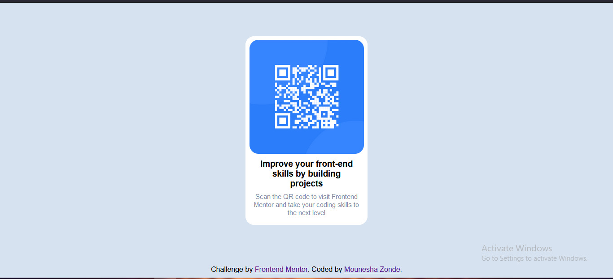

# Frontend Mentor - QR code component solution

This is a solution to the [QR code component challenge on Frontend Mentor](https://www.frontendmentor.io/challenges/qr-code-component-iux_sIO_H). Frontend Mentor challenges help you improve your coding skills by building realistic projects. 

### Links

- Live Site URL: [https://shadow-mo.github.io/QR-Code-Component-Challenge/index](https://shadow-mo.github.io/QR-Code-Component-Challenge/index)

### Built with

- Semantic HTML5 markup
- CSS custom properties
- Flex
- CSS Grid

## Author

- Frontend Mentor - [@Shadow-Mo](https://www.frontendmentor.io/profile/Shadow-Mo)
- Twitter - [@Mouneshazonde](https://www.twitter.com/Mouneshazonde)
